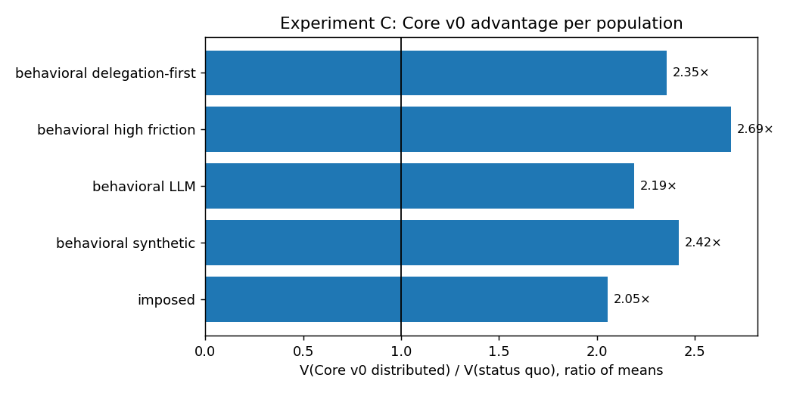
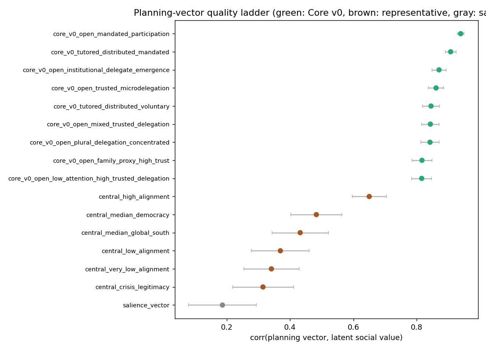
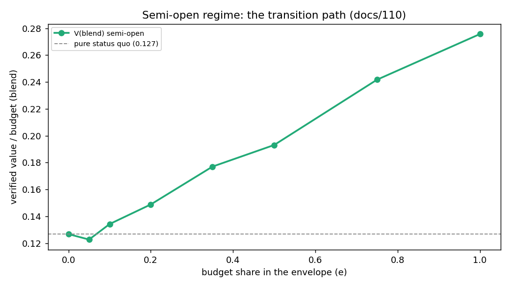
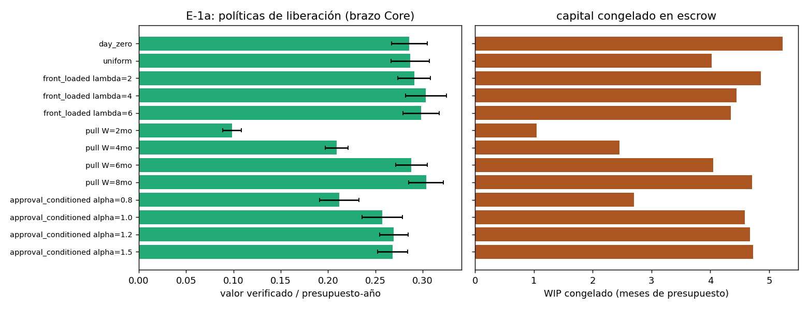

# Stress-Testing a Distributed Public-Resource Governance Architecture: Adversarial and Behavioral Agent-Based Evidence

**Draft v0.7 — 2026-07-07. Companion to the working paper "Distributed Resource Governance: An Architecture for Transparent Public Resource Allocation with Adversarial Validation" (doi:10.5281/zenodo.21193846), hereafter "the architecture paper".**

## Abstract

The architecture paper proposes Core v0, a public-resource allocation architecture in which citizens direct budget shares to concrete projects under milestone-gated, independently verified disbursement, with the non-participating share absorbed by the aggregated project allocation profiles over an authority- or society-drawn macro categorization. This companion paper reports the computational experiment program that stress-tests that architecture beyond its own simulation suite. We contribute a reproducible adversarial agent-based framework (deterministic engines, paired seeds, pre-registered designs with public prediction accounting, and a traceability contract binding every mechanism to its architectural anchor), a method for generating behaviorally realistic participation endogenously — including calibration by large-language-model-elicited priors under a cross-model stability discipline — and eight findings. (1) The architecture's advantage over an audit-calibrated status quo (2.0–2.7× verified value per unit of budget) is invariant across behaviorally generated populations and peaks under low adoption; participation without a default layer is not weaker but non-functioning. (2) Allocation quality dominates delivered value, and it has two layers the earlier engine had wrongly fused into one weight — a macro *categorization* (#1: a partition carrying no budget weights, only an alignment with value) and the aggregated project *allocation profiles* (#2: value-targeted vs attribute-incidental routing); distributed construction out-informs central everywhere its preconditions hold, and separating the layers (a correction the terminology work forced) shows distributing the categorization is irrelevant when the central plan is well-drawn, marginal under moderate misalignment (citizens' mixed profiles self-correct, leaking a bounded ~7–10%), and decisive when it is mostly bad — so Core v0's advantage over a central status quo is not fixed but grows from ≈1.9× to ≈5.7× as central planning worsens, the distributed arm being robust to a bad categorization and the central arm fragile to it. (3) The share of citizens contributing explicit planning signals is structural (~2.5–5%) across all prior sources. (4) The deterrence stack is individually redundant and jointly indispensable: removing any single term costs almost nothing, removing all of them drops the architecture below the status quo — a finding that traveled back into the architecture's canon as a deployment-integrity rule. (5) The transition from the status quo to the full architecture is a dial, not a leap: a semi-open budget envelope yields monotone, near-linear gains from roughly a ten percent share upward. (6) Treating the pipeline dynamically, the budget-release policy is a real institutional variable (pull-against-a-WIP-ceiling dominates calendar release), verification capacity is the pipeline's ceiling before it is the anti-fraud instrument, machine verification acts as capacity insurance whose lax accuracy requirement is *paid for* by the deterrence stack's slack, and adaptive adversaries neither erode nor invert the ranking while that stack is intact. (7) A real five-family model panel (Qwen, Gemma, DeepSeek local; gpt-5.5, Claude hosted) measures machine verification directly; after an internal review round caught a construct bug in the first instrument and it was rebuilt, the corrected result is capability-tiered — frontier models converge on good specificity and fraud detection, small local models are weaker — with the two frontier models sharing a measurable blind spot, and ensemble-independence, operating-point, and contraposition claims re-stated as exploratory or stipulated with confidence intervals; the machine layer covers only document-legible, delivery-phase fraud, not physical-quality or pre-contract theft. (8) A collusive, multi-period adversary is the first attack to move leakage by an order of magnitude (~25×), because it bypasses the per-milestone deterrence inequality — while the verified-value advantage survives — scoping the verification findings to a non-colluding adversary and making cross-layer collusion resistance a first-class requirement. Cross-framework docking and internal cross-engine replications support the architecture results (F1–F6); the machine-verification findings (F7–F8) are the least mature and are framed accordingly. Simulation evidence is not institutional proof; boundaries are declared throughout, and this paper's own second adversarial review round is reported, bug and all.

## 1. Introduction

The architecture paper asks whether today's technology permits a public-resource allocation design that improves on the incumbent institutional model, and answers with an architecture — Core v0 — validated by adversarial review and an eight-experiment simulation suite. Its governed object, and therefore ours, is the *discretionary, project-shaped portion* of a public budget (capital works, grants, local programs) — not payroll, transfers, or mandated services. That suite establishes the architecture's headline under its own assumptions. This paper attacks the assumptions.

Three families of question require a dedicated computational program. First, **behavioral realism**: the architecture paper imposes participation shares; what happens when participation *emerges* from an adoption process with friction, churn, social proof, and heterogeneous dispositions? Second, **mechanism accountability**: which of the architecture's mechanisms carry the results, which are redundant, and where are the cliffs — questions only ablation under adversarial pressure can answer. Third, **institutional dynamics**: the architecture specifies how money is allocated, disbursed, and verified, but real deployments must also decide *when* budget is released, *how much* verification capacity to fund, and *what happens over years* as adversaries adapt — variables the static suite cannot see.

Answering these requires methods worth reporting in their own right: engines whose every mechanism is anchored to a published architectural document (a traceability contract that makes "the simulation says" auditable), pre-registration with public prediction accounting in which refuted predictions are first-class findings, endogenous-participation generation, and a calibration path that uses large language models as *synthetic prior elicitors* — never as oracles — under a discipline that only cross-model-stable patterns inform anything.

Contributions: (i) the framework (Section 2); (ii) eight findings about the architecture (Sections 3–9a), two of them (machine verification, the collusive adversary) the least mature and framed as such; (iii) cross-framework and cross-engine validation (Section 10); (iv) a demonstrated feedback loop between simulation and institutional design, in which findings traveled into the architecture's corpus through its adversarial pipeline as operating-regime, deployment-integrity, budget-release, and verification-package rules; and (v) two internal adversarial review rounds reported in full, the second of which caught and corrected a construct bug in the machine-verification finding.

All results are simulation evidence about a model of the architecture — not institutional proof, not legal authorization, not pilot validation. Section 10 collects the declared boundaries.

## 2. Methods: the experiment framework

**Engines.** Four deterministic engines, all seeded (mulberry32 / Python `random`), version-stamped, and regression-anchored across versions: (A) a static adversarial architecture-comparison engine (JavaScript, dependency-free) implementing five institutional arrangements over a common project world; (B) a behavioral adoption model (Python; optional Mesa backend, byte-identical either way) generating populations — awareness, onboarding friction, activity, churn, role formation — under Core v0-conformant rules; (P) a planning-vector construction engine comparing how priority vectors are built; and (E) a longitudinal pipeline engine (v0.6–v0.8) adding budget-release policy, Poisson project arrivals, funding-window expiry, multi-cycle execution with milestone escrow, bounded verification capacity, executor reputation dynamics, machine-verification lanes, verification windows, and adaptive adversaries. Every result directory carries a metadata stamp (engine version, scenario, seed, runs); engine upgrades reproduce prior anchors exactly (the longitudinal anchor V = 0.303844218531 is bit-stable across v0.6→v0.8; the static engine's committed baselines are byte-identical across v0.4→v0.5.1).

**The traceability contract.** Every load-bearing mechanism maps to its anchor in the architecture corpus (the repository's traceability matrix): the public default rule, allocation secrecy, reputation-informs-never-excludes, evidence-triggers-never-certifies, conditional disbursement as the formal deterrence inequality, audit-anchored status-quo parameters, and the operating-regime vocabulary. Mechanisms without an anchor are either declared experiment-internal or listed as gaps. This converts conformance from a claim into a checkable artifact.

**Adversarial comparison discipline.** Architectures are compared on identical worlds (paired seeds; the same projects, opportunist draws, and citizen populations face every arrangement), under attacks (salience cascades, weak-verification shocks, fiscalizer collusion, agenda capture, coordinated signal bias), against a status quo calibrated to published audit-institution findings rather than to convenience — including the incumbent's actual control regime, not an opaque caricature. The primary metric is verified value per unit of budget (V): latent social value delivered, discounted by what independent verification can actually confirm.

**A normative commitment, named.** V presupposes that project-level social value exists prior to the mechanism and can be discovered and aggregated — the "latent social value" vector each world draws. That is a position, not a neutrality: the deliberative-constructivist tradition, in which value is *produced* by contestation rather than revealed by aggregation, is outside this model, as are redistribution, rights, and expressive politics that do not take the form of verifiable deliverables. Findings about "informational quality" of planning constructors are findings *within* this commitment; whether the architecture ranking survives an alternative objective (a min-share/Rawlsian target is the natural first test) is open and named as future work. Individual allocation privacy, a load-bearing mechanism referenced throughout, means ballot-style privacy of each citizen's directed allocation as an anti-coercion device — aggregates, budgets, projects, and every institutional act remain fully public.

**Endogenous participation (Experiment C).** The behavioral model's emitted trajectories — activity shares, channel choices (direct, profile, delegation, default), planning attentiveness — replace the static engine's imposed participation blocks through a published mapping. The architecture comparison then reruns under populations the adoption process actually produces, including a high-friction and a delegation-first world.

**LLM-elicited priors.** Where behavioral parameters lack empirical data (dispositional willingness, channel preferences, delegation acceptance), we elicit distributions from language-model panels role-playing twenty population-weighted archetypes, under three rules: the instrument is identical to the human questionnaire that will eventually replace it; provenance is recorded as `llm-elicited`, a class that cannot be promoted to empirical; and only patterns stable across model families inform conclusions. The limits of that discipline are stated plainly: the cross-family check (a local open-weights family paired against a frontier hosted family) is exercised at n=90; the precision-bearing N=1,000 panel is single-family and by construction cannot detect its own fingerprint, so its "convergence by n≈750, composition drift ≤0.02" is a within-model sampling statement, not calibration accuracy — a second frontier-scale family is named future work. Mean-sufficiency (using elicited means rather than full distributions downstream) was tested, not assumed: the committed distribution-versus-means analysis found downstream results insensitive to the collapse at these sample sizes, with the fixed-seed distributional runs as the check.

**Pre-registration, with its verifiability stated honestly.** Designs with named predictions were written before runs throughout, but the *git-verifiable* guarantee varies and we state it rather than blur it: the E-1a and E-1c designs were committed separately, minutes before their runs (independently checkable from history); the ablation and E-1b designs were committed atomically with their results (written first, but not separably provable); the semi-open quantification ran without a standalone design file and is classed as exploratory. A machine-readable predictions registry (`predictions.csv`: prediction → source → outcome) accompanies the repository. Of twenty-three registered predictions, eight were refuted or null in range and one materially transformed — each reported as a finding, several the most informative results of their phase.

## 3. Finding 1: the ranking is behavioral-population-invariant, and the default layer is existential

Under four behaviorally generated populations (synthetic baseline, LLM-calibrated, high-friction, delegation-first) plus the original imposed blocks, the ordering never changes: Core v0 with a distributed agenda delivers 2.05–2.69× the status quo's verified value per unit of budget (paired 95% intervals exclude zero everywhere; between-base-seed spread of the ratio is 2.19–2.28× on the calibrated population — statistical annex).

 Two structural results sit beneath the ratios. First, the advantage *peaks under low adoption* (high-friction: 2.69×): passivity routed through the default layer is the architecture's best case. The condition carrying that counterintuitive result must be named: it holds because the default profiles are *well-aligned* — their informational quality is exogenous in these worlds (signal mix 0.66 under the honest-signal boundary) — and the ablation's sweep prices the dependence: degrading the mix to 0.2 attenuates the advantage to 1.63× (never below it), while honest elicitation under gaming remains the architecture's declared open problem. Low adoption is the best case *given a well-constructed default*, not unconditionally. Second, the participatory variant without a default layer — the arrangement most civic-tech deployments implicitly build — collapses to **zero verified delivery under every realistic population**: with 3–6% active participation and no absorption rule, projects never reach funding thresholds. Participation without a default layer is not a weaker architecture; it is a non-functioning one. The design lesson is uncomfortable and quantified: the unglamorous default rule, not the participation feature, is what makes citizen allocation an institution rather than a poll.

## 4. Finding 2: allocation quality dominates — and it has two layers

The informational quality with which budget reaches value-bearing projects is the dominant lever on delivered value. The construction program compares constructors on correlation with latent social value: the Core v0 channel family (attentive citizen signals + delegated signals, voluntary or mandated) spans 0.815–0.939; representative central construction (coherent, bandwidth-limited, salience-guided planners from crisis legitimacy to high alignment) spans 0.315–0.650; pure salience reaches 0.187. The families do not overlap: **the worst distributed channel out-informs the best representative regime** — where its declared preconditions hold (an aggregation institution exists; signals are honest and unbiased), honest elicitation under gaming being the standing open problem. In the fused single-weight engine this gap was the dominant term everywhere: replacing distributed with central construction was the largest single-mechanism knockout (ΔV −0.062), and sweeping construction quality moved the advantage from 1.63× to 2.35× — the largest lever any single parameter commanded.

**This "planning vector" was, however, a single fused weight that conflated two institutionally distinct objects — and that conflation was itself a finding.** Sharpening the terminology (a canonical note now governs it) forced a model correction, because a third party reading the engine would misread the architecture. The two objects are: (#1) the **macro categorization** — a partition of eligible project types the authority or society draws, carrying *no* budget weights, whose only quality is how well its categories align with latent value; a central partition can admit misaligned (low-value) categories a distributed one would exclude. And (#2) the **project allocation profiles** — the weighted rules by which each citizen's share reaches concrete projects, spanning value-targeted rules ("rural early-childhood education") and attribute-incidental ones ("projects near me"). What governs delivery is the *aggregation of the inattentive majority's profiles*, not a macro vector. The fused engine is exactly the one-category reduction of the two-layer model and reproduces it bit-for-bit (the anchor holds exact with the feature off), so the earlier numbers stand as a reduced form — and the two-layer engine (Experiment H) then does what the fused one could not: **separate the two levers and show how they compound.**

The result is a *transition*, not a constant. Distributing the categorization (#1) is **irrelevant** when the central authority happens to draw well-aligned categories (both partitions deliver identically), **marginal** under moderate misalignment (citizens' mixed profiles route around the bad categories, and only the attribute-incidental fraction leaks — a bounded ~7–10% of budget), and **decisive** when the categorization is mostly bad (the good projects are not even eligible, and #2 cannot route to what is absent). Under distribution, delivered value is **robust to** the quality of the central categorization; under central planning it is **fragile to** it. Comparing architectures, this makes Core v0's advantage over a central status quo *not fixed* but a function of central-planning quality: it rises from ≈1.9× (well-drawn categorization) to **≈5.7× (mostly-bad)** because two effects compound — the *advantage of choosing* (#2 routes budget to higher-value projects) and *avoiding an imposed bad central plan* (#1 re-categorizes rather than being stuck with the authority's categories). The fused model could express neither; the two-layer model shows both. Politically, the reading is that adopting the distributed arm protects delivered value *even if the planner errs* — the value of distribution is largest exactly where central planning is worst.

## 5. Finding 3: the attentive share is structural

Across adoption scenarios and prior sources alike, the share of citizens contributing explicit planning signals stays bounded in the low single digits: the committed range, 2.5–5.1%, is the spread *across adoption scenarios* (2.5% under high friction to 5.1% under AI-assisted onboarding), and every prior source — synthetic dispositions, the paired n=90 panels, the weighted N=1,000 panel — lands inside it. Attentiveness moves with adoption context within that band but never escapes it: a bounded disposition, not a scalable engagement outcome. Two epistemic notes before the consequences. The agreement between synthetic and LLM-elicited priors is **not** convergent validity — both are non-empirical sources with overlapping provenance — so within the program this result holds the status of a hypothesis pending the identical human instrument. Its external benchmark is instead the participatory-budgeting field record: three decades of PB deployments report active-participation rates in the low single digits of the eligible population (Porto Alegre's canonical years, the cross-national surveys collected by Sintomer and colleagues, and Wampler's Brazilian comparisons), the same band the model produces endogenously — while the simulated polity omits what the field literature shows *moves* those rates: party mobilization, campaign cycles, and organized-group turnout, none of which are modeled beyond a scalar campaign-intensity parameter. What the finding then says is conditional and useful: designs that require more than single-digit spontaneous attentiveness are betting against both the model and the field record.

Three consequences. First, planning-layer designs must work at single-digit attentiveness — and do: the distributed vector's quality survives because delegation and defaults aggregate the attentive minority's information. Second, the architecture paper's imposed informed share (0.30 of participants) is behaviorally realizable: the LLM-calibrated adoption process produces 0.309 endogenously, and the architecture paper's own E8 experiment confirms the headline survives behavioral participation at 2.26× [2.23, 2.30] versus 2.22× imposed — both numbers recorded in the *master* repository's simulation-results (§E8), cited here as external evidence: E8 consumes this program's populations but runs, and is reproducible, in that repository, not this one. Third, the binding constraint on the control side is not adoption but the verification market — anticipating Finding 6.

## 6. Finding 4: the deterrence stack — individually redundant, jointly indispensable

The pre-registered ablation knocked out each mechanism. Deterrence terms fall in a distinctive pattern: removing detection intensity, financial terms, or reputational memory *individually* costs ≤ 0.003 V — at the designed operating point the incentive-compatibility inequality holds with slack, so every single term looks worthless at the margin. Removing the **whole stack** collapses verified value by 60% and drops the architecture **below the status quo (0.87×) with its selection quality intact**: distributed selection cannot compensate unverifiable delivery. The institutional threat is not an attacker but an implementer negotiating defensible concessions one at a time; the finding traveled through the architecture's adversarial pipeline (attack A041) and was resolved into its canon as a deployment-integrity rule — every scope publishes its deterrence-inequality margin, recomputed on every term change, with term reductions classed as material rule changes.

The attack program sharpened the picture. Fiscalizer collusion at plausible rates is *neutralized* by the stack's slack (the formal model's collusion-anticipation term made visible). Coordinated allocation bias among attentive citizens costs ≤ 0.007 at a fifty-percent coordinated share. The only attack that bites — capture of a published planning vector (−13% value, −35% selection quality at high severity) — presupposes a publishing choke point that exists only in the tutored-with-mandated-agenda regime; the distributed construction has no such surface, and its analog (signal corruption) is the robust case. The architecture's own regime doctrine absorbed this reading: capture pricing is an argument *for* distributed agenda construction, not against the architecture. Finally, the advantage *grows* with executor-pool dirtiness (2.39× at 70% opportunists): the dirtier the environment, the more the controls are worth.

## 7. Finding 5: the semi-open transition is a dial, not a leap

The architecture's operating-regime ladder defines a semi-open regime: a bounded budget envelope on protocol autopilot beside the authority's traditional budget. Its first quantification, as a fiscal blend over disjoint project pools: blended verified value rises monotonically and near-linearly with the envelope share — break-even near 8–10%, 1.52× at half the budget, 2.18× at full — with a single dip at five percent caused by two-project portfolio granularity, not by the regime. The envelope reaches full-architecture quality from roughly a 35% share; what grows thereafter is the share of budget enjoying it. For adoption politics this is the friendliest possible shape: no valley, no threshold, every increment pays, and the minimum sensible envelope is set by portfolio diversification, not by faith.

## 8. Finding 6: the pipeline view — release, verification, machines, and adversaries

The longitudinal program (Experiment E) makes time real: budget releases, projects arrive and expire, execution takes cycles under milestone escrow, verification has bounded capacity, reputation accumulates, adversaries adapt.

**Release policy (E-1a).** The authority's release schedule — a variable no architectural document regulated — matters institutionally. Day-zero release freezes 5.2 months of budget in execution escrow with the verification queue saturated; uniform monthly release (the implicit default of most public budgeting) maximizes project mortality through funding-window expiry; releasing against a **work-in-progress ceiling** (a pull policy) dominates the Pareto frontier at `W*`` ≈ 7 months of budget. The mechanism is Little's Law: healthy WIP ≈ achievable throughput × cycle time, and `W*`` tracks the *binding resource* — verification capacity when scarce, execution duration when abundant. Feedback release conditioned on recent approval *flow* underperforms (0.269 vs 0.304); the correct conditioning variable is the outstanding-commitment *stock*, which is what pull implements. Under scarce verification capacity, no policy recovers the ceiling (V ≤ 0.255) and over-release actively destroys value (0.236) — **verification capacity is the pipeline's ceiling before it is the anti-fraud instrument**.

A public-finance caveat belongs in the main text, not a footnote: the model's treasury does not lapse, while most appropriations regimes enforce fiscal-year annuality. The release rule is therefore stated *conditional on a carryforward instrument* — a capital fund, revolving fund, or multi-year investment program; the architecture's semi-open envelope is precisely such a vehicle — and under strict annuality it degenerates to within-year pull. An E-1a variant with lapsing funds and explicit encumbrance is pre-committed as the next engine run.

**Machine verification (E-1c).** Modeling an AI verifier as a triage system (auto-release for protocolizable evidence classes, referral-with-dossier, unconditional human sampling) with the deterrence coupling made explicit — sophisticated opportunists anticipate the end-to-end detection probability — yields three results. At scarce capacity, triage lifts the ceiling no release policy could (0.254 → 0.316). The pre-registered accuracy crossover *never appears* up to a 20% false-pass rate: the dossier effect and the deterrence stack's slack absorb verifier error, so the accuracy requirement for a useful machine verifier is remarkably lax — **conditional on an intact stack**. And the human sampling lane's binding role is epistemic (measuring the machine's real error rate), not leak-plugging. Verification windows address a different failure: fiscalizer unresponsiveness costs up to 38% of delivered value, and a one-cycle timeout with automatic reassignment recovers ~80% of it; timeouts fix the tail, never the ceiling.

**Adaptive adversaries (E-1b).** Congestion-timed diversion under evidence staleness, evidence gaming against the machine lane up to skill 0.55, and eight years of dynamics all move verified value within noise on the intact configuration; the pull rule removes the congestion attack surface outright (backlog too short for evidence to stale), and even at engineered joint failure (scarce capacity + day-zero release, queue of thirty) the timing-aware adversary gains only fractions of leakage. On a **broken** stack, every verification arrangement — human, machine, gamed machine — lands within noise of the same collapse (V ≈ 0.114–0.118): *verification is downstream of deterrence; nothing at the verification layer compensates a broken incentive floor*. Reputation compounding over eight years is null in range: the advantage is flat and robust from the first cycle, because a stack that deters from the start never dwells at the margin where memory would compound. The program's institutional closure fits in three lines: **size the capacity; meter the release; protect the margin.**

**The verifier-displacement problem and its frontier (E-1d).** A near-zero-price machine verifier is a *displacement threat* to the human fiscalizer market whose sampling is the machine's only audit: it collapses both the cost of fiscalization and the incentive to fiscalize, and with it the epistemic layer that measures the machine. The design answer, recorded in the architecture corpus and evaluated here, places humans permanently as the **second instance** — a mandated audit layer funded by a published control-budget floor (the machine's savings re-allocate to its own auditors; a complement by rule, not a competitor on price). The coverage frontier is **universal exposure, selective inspection**: every disbursement faces a nonzero published probability of human second-instance review, and the mandatory (probability-one) set comprises non-protocolizable evidence classes, stakes above a scope-published threshold, executors with thin track records, machine-flagged anomalies, complaint-triggered reviews, and post-model-change windows. The E-1d evaluation then corrected the design's own epistemics: with an intact deterrence stack, a verifier drifting from 5% to ~95% false-pass costs almost nothing (V −0.002) *and passive sampling never detects it* — near-zero true positives make the false-pass rate unmeasurable at any affordable sampling rate. The healthier the system, the blinder its outcome audit. The frontier's epistemic instrument is therefore **seeded positive controls** — known-violation probes injected into the machine lane at rate q, giving drift-detection latency ∝ 1/(q·π) independent of the deterred real diversion rate — while the random floor `s_min` serves exposure, appeals, and deterrence optics. Human second-instance review is thus *always on* as statistical exposure and seeded probing for every project, and *always total* only inside the mandatory set.

## 9. Finding 7: machine verification measured — a real five-family panel

Finding 6's machine-verification results used stipulated error rates; the F program measured them on five real model families — Qwen3.6-35B, Gemma 4-26B, and DeepSeek-R1-14B running locally; gpt-5.5 and Claude hosted — judging ground-truth evidence vignettes committed before any run, machine-scored, decoding disclosed per family (they cannot be made uniform; the comparison is family + recommended decoding, not a controlled sampler comparison, so the cross-family claims are treated as exploratory). This section was **rebuilt after an internal review round found a construct bug** in its first instrument, and the correction changed the headline; we report the corrected result and the bug, because the correction is itself the most instructive part.

**The bug, and why it matters.** The first "subtle-fraud" instrument attached, to every *clean* bundle, an invoice line item above the approval threshold the bundle itself published — with no approval record. Models that flagged those bundles were *correct*; scored against a "clean" label, they registered as false alarms. This inverted the apparent result: gpt looked like an 80%-false-flag hair-trigger when it was in fact catching a real control violation the label denied. On a de-leaked instrument (every above-threshold amount carries a proper approval; the threshold-structuring fraud remains the one that splits items *under* the threshold to evade it), the picture is different and cleaner.

**Corrected result: frontier models converge on good specificity; small local models are weaker.** On mechanically-checkable flaws every family catches essentially everything (correlation untestable, declared). On judgment-requiring flaws, with Wilson 95% intervals:

| family (scale/host) | false-pass, subtle fraud [95% CI] | false-flag, clean work [95% CI] |
|---|---:|---:|
| gpt-5.5 (frontier, hosted) | 0.083 [0.036, 0.181] | **0.033 [0.009, 0.114]** |
| Claude (frontier, hosted) | 0.083 [0.036, 0.181] | 0.083 [0.036, 0.181] |
| Gemma 4-26B (local) | 0.200 [0.116, 0.324] | 0.265 [0.162, 0.403] |
| DeepSeek-R1-14B (local) | 0.200 [0.118, 0.318] | 0.567 [0.441, 0.684] |
| Qwen3.6-35B (local) | 0.000 (approves nothing) | 0.981 [0.899, 0.997] |

The two frontier models have good and statistically similar specificity *and* fraud detection (≈0.08 on both axes); the small local models are materially weaker on both; Qwen is degenerate under this prompt (deny-all). **The v2 "6× temperament spread across families" and the "evidence-richness rescue" were leak artifacts and are withdrawn** — with a fair instrument, gpt is not a hair-trigger. The honest cross-family reading is capability-tiered (frontier vs small-local), not a five-way temperament ranking, and the family/decoding confound is disclosed rather than claimed away.

**Correlation is exploratory and underpowered — with one real signal.** Joint false-pass counts are 0–4 events, so every pairwise φ and ensemble ratio is reported with a caveat and a bootstrap CI, not as a resolved estimate. Of ten two-stacks, two have a bootstrap ratio interval strictly above the independence prediction; the clearest is the **frontier pair gpt–Claude (φ=0.78, Fisher p<0.001, ensemble 9.6× worse than independence [4.7, 30])** — a genuine shared-blind-spot signal between the two large hosted models, exactly the dependence that makes naive "just add a second model" over-promise. The effective common-cause ρ is small (≈0.02–0.06); the pre-registered "ensemble fails worse than independence" holds directionally but at n≈60 cannot support the two-significant-figure multipliers the first version quoted. In the pipeline engine, a second layer pays only against independent-error fraud (`k*`=2, benefit gone by ρ=0.3) and multiplies honest referrals.

**Operating points are steerable — the true version of a claim the bug had corrupted.** With the leak removed, the "evidence richness rescues Claude 95%→5%" story is gone (it was the artifact). What survives is the weaker, defensible statement: a calibration probe moved gpt's false-flag rate by instruction alone at a recall cost, so operating points are prompt-conditional, and evidence contracts that include objective comparison references (market benchmarks, duration bands, thresholds) let a strict verifier judge rather than guess. This is a hypothesis supported by the probe, not a within-instrument-controlled measurement.

**Feeding measured points into the pipeline (F-3) — relabeled as a sensitivity, not a measurement.** Injecting the measured worst-family operating point (~0.20 false-pass) into the longitudinal engine, on an intact deterrence stack, leakage stays indistinguishable from pure-human verification, because the cascade removes the *attempts* upstream; and no verifier rescues a broken stack. The engine's other verification parameters (protocolizable share, sampling rate, dossier boost) are stipulated, not measured, so F-3 is a stipulated-mechanism sensitivity around the measured accuracy, not an end-to-end measurement. The institutional reading holds: today's imperfect models suffice at the verification layer *provided the incentive cascade is intact and the adversary is non-colluding* (Section 9a).

**Contraposed citizen evidence (F-4) — a stipulated-mechanism sweep, strong but bounded.** Independent evidence producers with interests opposed to the executor, whose anticipated contradiction deters diversion, are modeled with a stipulated catch rate and swept coverage (not measured): leakage falls sharply with coverage on the intact stack, and the instrument is the only one that substantially rescues a *degraded* stack — but that rescue is an upper bound that assumes the contributor layer is genuinely independent, which Section 9a shows a colluding ring erases. Human review then concentrates where machines disagree, confidence is low, stakes are high, evidence contradicts, or the random floor fires; the resulting human-touch share (light, dossier-assisted) is bounded below by the mandatory set, which on a *value-weighted* real portfolio is likely a larger fraction than a project-count estimate suggests — so the "70–85% less verification labor" figure is stated as document-verifiable-layer, project-count basis, and flagged as an over-count of the value-weighted reduction.

**Scope (what the machine layer cannot reach).** Every result here is over *document-legible, delivery-phase* fraud. The costliest public-works fraud is not in the evidence bundle at all: pre-contract collusion and overprice steal before the first milestone; quality-below-spec (concrete at 60% strength, substituted materials behind finished surfaces) photographs perfectly and is caught only by physical testing; quantity fraud is the gap between a consistent record and the world. "Court-grade by construction" overstated attested provenance — the accurate claim is *tamper-evident and provenance-attested at capture*, with chain of custody, contradiction, and expert testimony still required for admissibility and weight. Machine and citizen verification cover the document layer; the physical and pre-contract layers remain fully human.

## 9a. Finding 8: the collusive adversary — where the verification story breaks

Findings 6–7 (E-1b, F-3, F-4) drew the diversion decision **once**, as an expected-value bet against the published detection probability, with the verification layers priced as independent draws whose protections *multiply*. A real adversary is multi-period and collusive. Experiment G models a ring that controls, on a share of milestones, the executor *and* its verifiers *and* its citizen-evidence contributors — so for those milestones cross-layer outcomes are set by the ring (it diverts, its verifiers clear, its contributors stay silent), and protection is the **minimum, not the product**.

The result is the first attack in the entire program to move leakage by an order of magnitude: at collusion rates from 0 to 50% leakage rises ~25× (0.0021 → 0.052), where every single-instrument attack in Finding 6 moved it by less than 2×. It also **halves the F-4 contraposition rescue** (colluded milestones produce no contradiction, so the router summons no human). Two facts sit together and both are the finding: leakage rises sharply, yet the *verified-value* advantage over the status quo survives the whole range (2.72× → 2.56×), because the honest majority still carries delivery — so the security story lives in the leak column, not the value ratio, a distinction the value-reporting earlier findings obscured. Adaptive blind-spot targeting and poisoning of the exogenous price reference are real but bounded on an intact stack (they still route through the per-milestone inequality); collusion is dangerous precisely because it does not.

The consequence, now in the architecture corpus (docs/113): cross-layer collusion resistance is a first-class requirement, not a residual caution — verified beneficial ownership so a ring cannot cycle shells, contributor-layer Sybil-resistance so contraposition coverage cannot be astroturfed or silenced, and decentralization of the assigner/seeder/floor-setter so a ring cannot route its fraud to its own captured reviewer. Findings 6–7 are hereby scoped to a **non-colluding** adversary; the collusive case is the frontier this program reached but did not close, and the deepest form of the paper's own standing caveat — this is a single-author adversary model, and the missing independence is a second author for the adversary.

## 10. Cross-validation

**Cross-framework dock.** An independent Mesa-native Python reimplementation of the static architecture comparison (different language, paradigm, and RNG — Mesa 3.5.1 with Python's `random`, versus dependency-free JavaScript with mulberry32; equivalence assessed distributionally per Axtell et al.'s docking standard) reproduces the five-architecture comparison on the LLM-calibrated population at **15/15 PASS** (five architectures × three metrics, every |Δmean| within two pooled standard errors): verified value per budget 0.2780 vs 0.2774 for the distributed-agenda arm, exact zero–zero agreement on the no-default collapse, and matching leakage and selection-correlation distributions throughout (`docking/DOCKING_REPORT.md`). The largest residual divergence is disclosed rather than averaged away: the dock's status-quo cell lands at 0.1345 versus the reference's 0.1267 — inside the band (|Δ| 0.0077 vs 0.0114), but enough to move the dock-side headline ratio to ≈2.07× versus the reference's 2.19×. The docking claim is therefore ordinal and distributional: same ranking, same collapse structure, ratios agreeing to within ~5% — not decimal-identical ratios. The equivalence criterion (two pooled standard errors per cell) was fixed in the docking brief before the port ran; a pre-specified TOST margin is the named upgrade for revision.

**Internal cross-engine docks.** Three replications across structurally different engines: the longitudinal engine's degraded-stack cell (V = 0.114, leak 0.057) reproduces the static ablation's joint-knockout cell (0.110, 0.053); the architecture paper's E8, consuming this program's behavioral populations in its own engine, reproduces its imposed-participation headline (2.26 vs 2.22); and the emergent attentive share (Experiment B) lands inside the range the planning-vector program had assumed independently.

**Statistics.** Paired-by-seed comparisons throughout; the annex reports 95% t-intervals and Fieller/bootstrap ratio intervals — every headline paired difference and ratio excludes its null — plus the multiple-comparison statement over the committed prediction registry (`predictions.csv`, 42 predictions of which the F-program correlation set is declared exploratory and uncorrected). The machine panel's actual per-family coverage (not a nominal 600) is reported in its own table.

## 11. Limitations and declared boundaries

- **LLM priors are synthetic.** They carry model-family fingerprints; only cross-model-stable patterns informed conclusions, and the identical human instrument is the designed replacement. No `llm-elicited` quantity was promoted to empirical.
- **Honest elicitation under gaming is the architecture's declared open problem**; every engine assumes honest signals and says so. The planning-vector results hold conditional on that boundary.
- **Model boundaries**: no per-project authority veto stage (the tutored/semi-open decision-layer difference is unpriced); milestone objects are escrow schedules, not full evidence contracts; single-scope worlds (no federation); verification staleness parameters stipulated, directional claims only; the demand-smoothing instrument was implementation-biased and is demoted pending a delay-neutral scheduler (declared, not hidden).
- **Reputation-compounding null** is at this engine's project granularity; higher-throughput economies could compound faster.
- **Status-quo calibration** anchors to published audit-institution findings; jurisdictions differ, and the architecture paper's own calibrated-baseline rule governs what "status quo" means here. The incumbent's flatness across *participation* populations is by construction (it has no participation channel), and its institutional functions that V does not measure — electoral preference aggregation, deliberative conflict mediation, distributional bargaining, legitimacy production — are outside the metric and therefore outside every ratio reported here. Distributional-outcome metrics are the designed follow-up.
- **The legal layer is beneath the model, not inside it.** Citizen allocation directs funds to *projects*; executor award and payment run through existing procurement law (the architecture's allocation-act characterization keeps the citizen act pre-procedural), milestone-gated disbursement maps onto ordinary progress-payment practice, and statutory debarment is country law operating outside the platform — fully compatible with the platform itself never excluding. Procurement's cost, delay, protest processes, and set-aside obligations are unmodeled. Likewise, the architecture's fiscalizers are its own control market, *not* the constitutionally independent state audit bodies, which remain unchanged and appear here only as calibration sources; and the administrative-law status of machine-gated disbursement (due process, appealability — the complaint path is the designed appeal hook) is an open deployment question paired with the second-instance human design.
- **Scope of the governed object.** Most public spending is recurring services and transfers; the architecture governs the discretionary, project-shaped portion of a budget (capital works, grants, local programs). Every headline claim should be read at that scope, with the envelope share calibrated to a jurisdiction's real discretionary composition at deployment.
- **Simulation evidence, not institutional proof.** The program measures a model. Its role is to find breakpoints, rank mechanisms, and hand the architecture quantified questions — three of which it already answered into the architecture's canon.

## 12. Conclusions

Six architecture findings survive an adversarial, pre-registered, behaviorally grounded program: the ranking is population-invariant and the default layer existential; allocation quality dominates — decomposed, after a terminology-forced model correction, into a macro categorization (#1) and the aggregated project allocation profiles (#2) the earlier engine had fused — and the distributed arm is robust to the quality of the central categorization while the central arm is fragile to it, so the advantage over a central status quo grows (≈1.9×→≈5.7×) as central planning worsens; attentiveness is structural and single-digit; the deterrence stack is complements-not-substitutes with a published-margin rule as its deployment consequence; the transition is a dial; and the dynamic pipeline adds three institutional rules — size the capacity, meter the release, protect the margin — with machine verification as capacity insurance whose safety the deterrence stack itself underwrites, and the human second instance as the machine's permanent auditor. Two further findings are held to a lower confidence and said so: the machine-verification panel, whose first instrument carried a construct bug that a second review round caught and whose corrected result is capability-tiered and partly exploratory; and the collusive adversary, the first attack to move leakage by an order of magnitude and the frontier at which the verification story breaks and this single-author program most needs a second author for the adversary.

Two meta-results matter beyond this architecture. Methodologically, the combination — traceability contracts, pre-registration with public refutations, endogenous participation, LLM-prior calibration under cross-model discipline, and docking — is a portable recipe for computational institutional design. Institutionally, the program demonstrates a disciplined feedback loop between simulation and design: findings entered the architecture's corpus through its published attack–defense–resolution pipeline, with recorded verdicts. An honesty note belongs beside that claim: the simulation, the architecture, the pipeline, and the verdicts are one author's ecosystem — the loop demonstrates *process discipline* (findings cannot silently change the design; refutations are published), not independent validation. The independence step is external: the architecture paper's prepared expert-review packets and, ultimately, the human calibration instrument and a bounded pilot. Within that boundary the claim stands: simulation did not flatter the architecture; it argued with it, refuted a third of its own predictions in public, and forced two design rules the architecture did not previously have.

## Reproducibility statement

All engines, scenarios, results, figures (with accessible textual descriptions), designs, and prediction accounting are in the public repository, with one-command reproduction (`python tools/reproduce_all.py`) covering every committed artifact except the LLM panels, which are committed with full provenance and prompts. Code MIT, documents and results CC BY 4.0.

## References

- Axtell, R., R. Axelrod, J. M. Epstein, and M. D. Cohen (1996). "Aligning Simulation Models: A Case Study and Results." *Computational and Mathematical Organization Theory* 1(2).
- Baiocchi, G., and E. Ganuza (2014). "Participatory Budgeting as if Emancipation Mattered." *Politics & Society* 42(1).
- Becker, G. (1968). "Crime and Punishment: An Economic Approach." *Journal of Political Economy* 76(2).
- Epstein, J. M. (2006). *Generative Social Science: Studies in Agent-Based Computational Modeling.* Princeton University Press.
- Fox, J. (2007). "The Uncertain Relationship Between Transparency and Accountability." *Development in Practice* 17(4–5).
- Holmström, B., and P. Milgrom (1994). "The Firm as an Incentive System." *American Economic Review* 84(4).
- Little, J. D. C. (1961). "A Proof for the Queuing Formula: L = λW." *Operations Research* 9(3).
- Malesky, E., P. Schuler, and A. Tran (2012). "The Adverse Effects of Sunshine: A Field Experiment on Legislative Transparency in an Authoritarian Assembly." *American Political Science Review* 106(4).
- Milgrom, P., and J. Roberts (1990). "The Economics of Modern Manufacturing: Technology, Strategy, and Organization." *American Economic Review* 80(3).
- Milgrom, P., and J. Roberts (1995). "Complementarities and Fit: Strategy, Structure, and Organizational Change in Manufacturing." *Journal of Accounting and Economics* 19(2–3).
- Offermann, M. (2026). "Distributed Resource Governance: An Architecture for Transparent Public Resource Allocation with Adversarial Validation." Working paper, doi:10.5281/zenodo.21193846.
- Ostrom, E. (1990). *Governing the Commons: The Evolution of Institutions for Collective Action.* Cambridge University Press.
- Railsback, S. F., and V. Grimm (2019). *Agent-Based and Individual-Based Modeling: A Practical Introduction.* 2nd ed., Princeton University Press.
- Sintomer, Y., C. Herzberg, and A. Röcke (2008). "Participatory Budgeting in Europe: Potentials and Challenges." *International Journal of Urban and Regional Research* 32(1).
- Spearman, M. L., D. L. Woodruff, and W. J. Hopp (1990). "CONWIP: A Pull Alternative to Kanban." *International Journal of Production Research* 28(5).
- Wampler, B. (2007). *Participatory Budgeting in Brazil: Contestation, Cooperation, and Accountability.* Penn State University Press.
